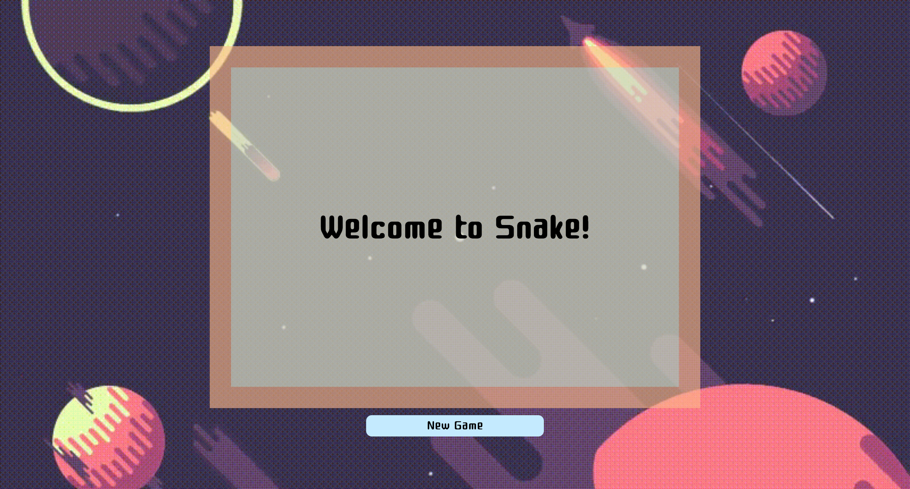
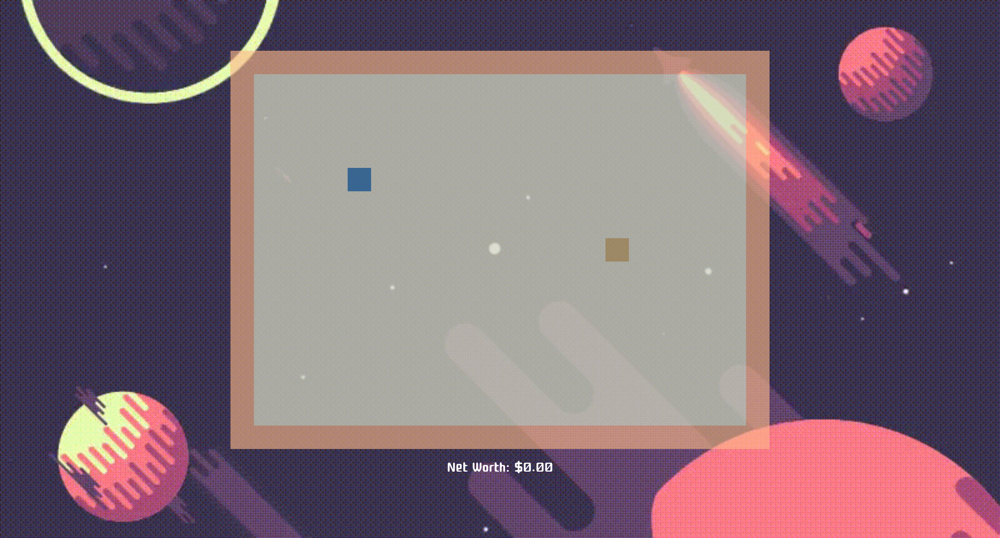
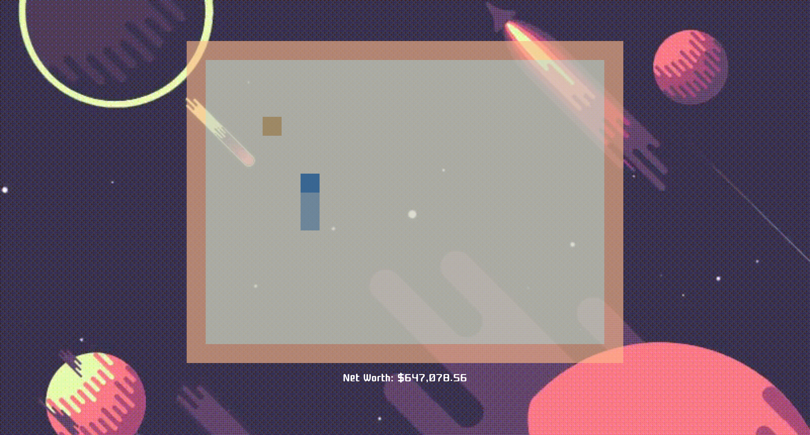

# Project One - Snake Game

Software Engineering Immersive: Project 1 (Solo Project)

This was a solo project assigned for the Software Engineering Immersive at General Assembly London (Week 3) built with Vanilla.js.

## Built With

1. HTML
2. JavaScript
3. CSS

# User Experience

## Intro Screen

I designed the intro screen to display be as descriptive of the content of the app, yet as minimal as possible. It consists of merely the phrase 'Welcome to Snake!', followed by a button below that states 'New Game'.



#

## Start Screen

The start screen displays the snake as a single square that is positioned static on the screen. The snake start position remains the same upon each new game. The apple location is randomly generated upon each new game play and again when an apple is eaten.



#

## Game Play Screen

In order for the game to start, the user must strike one of the four arrow keys on the keyboard. This will initiate snake movement, and the player will start to see the snake move in the specified direction. The user is not able to pause the game, hence any lack of input from the user will eventually cause the game to end, as the user's session will end upon the snake either colliding with a wall or with itself.

Each time an apple is eaten by the snake, four functions are called:

- `clearFood() && createFood()` - Clears the old apple and Generates a new apple
- `level += 1` - Elongates the snake
- `increaseSpeed()` - Increases the speed of the snake's movement
- `totalScore += 323539.28` - Increases the score



#

## Game End Screen

Upon the snake's collision with either itself or a wall, the game will end, and the user's final score will be displayed. The user will be given the option to restart the game by clicking the 'Play Again' button displayed at the bottom of the screen.

Upon invocation, the 'Play Again' button will reset the score, level and length of the snake. The user can then play the game again without having to refresh the page.


#

# Planning and Development

## Planning

Planning for this project took the good portion of a whole day and entailed brainstorming different methods to use for different aspects of the game. These methods were taught to the class during the first two weeks of our time at GA, and encompass array methods, CSS techniques, DOM manipulation and HTML practices.

## Development

- The Grid:

  The grid is generated using the following code:

```
  function makeGrid() {
    Array(height * width).join('.').split('.').forEach(() => {
      const box = document.createElement('div')
      box.classList.add('grid-item')
      cubes.push(box)
      grid.appendChild(box)
    })
  }
```

This code generates an array that contains a total index length equal to the width multiplied by the height.

- The Snake:

  The snake itself is an array that uses the `unShift` method to change position upon each timeslot, which in-turn is dictated by the level the user has reached (i.e. the higher the level, the shorter the time gap between each function recall).

- Snake Movement:

  A series of `if` statements are used to decipher which key the user has pressed and dictate which direction the snake should move in response. Each `if` statement is also equipped with a condition to ensure the user cannot instantaneously move in the opposite direction, as per the rules of the classic snake game (i.e. a user cannot move directly down if they are already travelling upwards on the screen, and vice versa; they must make two right or left turns consecutively).

- Apple/Food generation:

  The apple starts off in a completely random section of the screen, which is generated to fall between the numbers 0 and 315 (width of 21 multiplied by height of 15). Once a number has been generated, a class of `'food-location'` is added to the number, so the DOM renders the appropriate square number on the table as a different colour, so the user is aware of the location of the food. The following `if` statement is used to ensure that the food does not fall on the same location as the snake:

```
if (cubes[foodNumber].classList.contains('userOne') || cubes[foodNumber].classList.contains('tail')) {
      clearFood()
      createFood()
    }
```

- Kill Game:

  Upon the user colliding with a wall or with the tail of the snake, the `killGame()` function is called, which resets all gameplay variables back to their original states and allows the user to restart the game if they wish to.

```
 function killGame() {
    running = false
    gameOver = true
    stopTimer()
    removeSnake()
    clearFood()
    grid.innerHTML = ''
    loseScreen()
    newGameButton.classList.add('new-game-button')
    newGameButton.innerHTML = 'Play Again'
    supremeBox.appendChild(newGameButton)
  }
```

## Project Management

I structured the seven days I had as follows:

Day 1:

- Planning on paper

Days 2 - 6:

- Development of game functionality

Days 6 - 7:

- Styling
- Presentation of end product

## Successes and key learnings

I believe this project posed many challenges for myself that I was able to overcome. This project was truly the steepest learning curve throughout the duration of General Assembly’s Software Engineering Immersive.

My successes throughout the duration of this project include understanding and implementing different methods used on JavaScript data types. For example:

- Learning how to map through items in an array, which is how the grid for the game is produced:

```
function makeGrid() {
    Array(height * width).join('.').split('.').forEach(() => {
      const box = document.createElement('div')
      box.classList.add('grid-item')
      cubes.push(box)
      grid.appendChild(box)
    })
  }
```

- Learning how to use a for loop, which is how the snake knows if it has collided with itself:

```
function selfCollision() {
    for (let i = 1; i < snakeArray.length; i++) {
      if (snakeLocation === snakeArray[i]) {
        killGame()
      }
    }
  }
```

- Learning how to use an if statement, which is how the food on the grid knows not to appear on the same square as the snake:

```
if (cubes[foodNumber].classList.contains('userOne') || cubes[foodNumber].classList.contains('tail')) {
      clearFood()
      createFood()
    }
```

- Learning how to use a ternary operator, which is how the game knows when to end:

```
function upMove() {
    removeSnake()
    snakeLocation - width >= 0 ? snakeLocation -= width : killGame()
    addSnake()
  }
```

- Learning how to use DOM manipulation techniques, so that the game renders the correct information to the player:

```
scoreDisplay.classList.add('score-display')
scoreDisplay.innerHTML = 'Net Worth: $0.00'
supremeBox.appendChild(scoreDisplay)
```

Additionally, I improved my ability to work within a tight time frame, how to plan for a project like this, and how to identify my areas of improvement and develop them with confidence.

## Challenges & future improvements

The development of this game posed many challenges that I am proud I was able to overcome. As this was my first ever attempt using JavaScript to develop an application, coming to understand how certain methods work and how they should be used was initially quite hard. Throughout the journey of this first project, I collaborated and shared ideas with my classmates, as a few of us were attempting to create a snake game.

I found that I was also practicing other skills throughout the duration of this project, such as time management and prioritization. There were certainly ups and downs, and the process of developing this game was perhaps the biggest challenge I have faced so far on my coding journey, as all the concepts were completely new to me and I had to adapt my way of thinking and problem solving.

I am very happy with the final product I produced, how much I grew over the course of that week and the challenges learned to overcome.

Knowing what I know now, I would be able implement some different strategies for the game development and refactor the code, so it is clearer. For example, I would use a switch statement for the user's key invocation to dictate which direction the snake should move each time an arrow key is pressed.
